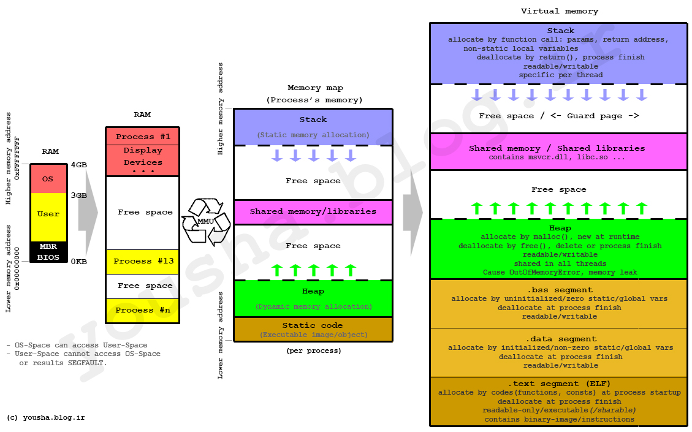
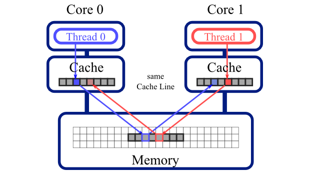

# AMS 595 C++ code from the lectures

## How to build & run

Below is the easiest way to build a C++ source file from this repo

`g++ -std=c++11 my_code.cpp -o my_executable`

Below is how to let the compiler warn you about potential mistakes in your code

`g++ -Wall -Wextra -std=c++11 my_code.cpp -o my_executable`

Below is how to tell the compiler to choose an optimization level

`g++ -std=c++11 -O0 my_code.cpp -o my_executable`

Levels of optimization for GCC/G++:
* -O0: No optimization (useful for debugging)
* -O1: Optimize something
* -O2: Optimize more (recommended, usually safe)
* -O3: Turn on aggressive optimizations (may not be faster, and may cause errors)
* -Ofast: Highest level of optimization (almost never worth it)

To run the compiled code, use

`./my_executable`

Other useful compiler options will be added later

## Install GCC/G++ on macOS

1. Open Terminal.app, you can search for it in the Spotlight Search

2. Go to [Homebrew Website](https://brew.sh) in your browser, follow the instructions to install homebrew

3. Once it is installed, first use `brew update` to make sure it has the latest package database

4. Finally, use `brew install gcc` to install GCC, this will also install G++

5. Now you should be able to compile C++ source code with the command `g++-8 -std=c++11 foo.cpp -o foo`. Notice that the command `g++` also works but it is NOT the real GNU compiler.

## Memory layout: Stack v.s. Heap

## False sharing

